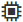
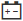

= Ver el estado y la configuración de componentes de bandejas
:allow-uri-read: 
:experimental: 
:icons: font
:imagesdir: ../media/

[role="lead"]
En la página hardware, se proporcionan el estado y la configuración para componentes de bandejas, que incluyen suministros de alimentación, ventiladores y baterías.

.Acerca de esta tarea
Los componentes disponibles dependen del tipo de bandeja:

* *Bandeja de unidades* -- contiene un conjunto de unidades, contenedores de alimentación/ventilador, módulos de entrada/salida (IOM) y otros componentes de soporte en una sola bandeja.
* *Bandeja de controladoras* -- contiene un conjunto de unidades, uno o dos contenedores de controladora, contenedores de alimentación/ventilador y otros componentes de soporte en una sola bandeja.

.Pasos
. Seleccione *hardware*.
. Seleccione la lista desplegable para la bandeja de controladoras o bandeja de unidades y luego seleccione *Ver configuración*.
+
Se abre el cuadro de diálogo Configuración de componentes de bandeja, con pestañas en las que se muestran el estado y la configuración relacionados con los componentes de la bandeja. Según el tipo de bandeja seleccionada, es posible que algunas de las pestañas descritas en la tabla no aparezcan.

+
[cols="25h,~"]
|===
| Pestaña | Descripción 

 a| 
Bandeja
 a| 
La ficha *Bandeja* muestra las siguientes propiedades:

** *ID de bandeja* -- identifica de forma exclusiva una bandeja en la cabina de almacenamiento. El firmware de la controladora asigna este número, pero es posible cambiarlo seleccionando MENU:Bandeja[Cambiar ID].
** *Redundancia de ruta de bandeja* -- especifica si las conexiones entre la bandeja y el controlador tienen métodos alternativos en su lugar (Sí) o no (no).
** *Tipos de unidad actuales* -- muestra el tipo de tecnología integrada en las unidades (por ejemplo, una unidad SAS compatible con la función de seguridad). Si hubiera más de un tipo de unidad, se muestran ambas tecnologías.
** *Número de serie* -- muestra el número de serie del estante.

 a| 
Iom (ESM)
 a| 
La ficha *IOM (ESM)* muestra el estado del módulo de entrada/salida (IOM), que también se denomina módulo de servicios ambientales (ESM). Supervisa el estado de los componentes de una bandeja de unidades y funciona como el punto de conexión entre el soporte de unidades y la controladora.

El estado puede ser Optimal, Failed, Optimal (Miswire) o sin certificar. Otra información incluye la versión de firmware y la versión de configuración.

Seleccione *Mostrar más valores* para ver las velocidades de datos máximas y actuales y el estado de la comunicación de la tarjeta (Sí o no).

[NOTE]
====
Para ver este estado, también se puede seleccionar el icono de IOM , Junto a la lista desplegable Bandeja.

====

 a| 
Suministros de alimentación
 a| 
La ficha *fuentes de alimentación* muestra el estado del contenedor de alimentación y de la fuente de alimentación. El estado puede ser Optimal, Failed, Removed o Unknown. También muestra el número de pieza del suministro de alimentación.

[NOTE]
====
Para ver este estado, también puede seleccionar el icono de suministro de alimentación image:../media/sam1130-ss-hardware-power-icon.gif[""], Junto a la lista desplegable Bandeja.

====

 a| 
Ventiladores
 a| 
La ficha *ventiladores* muestra el estado del contenedor de ventilador y del ventilador en sí. El estado puede ser Optimal, Failed, Removed o Unknown.

[NOTE]
====
También puede ver este estado seleccionando el icono de ventilador image:../media/sam1130-ss-hardware-fan-icon.gif[""], Junto a la lista desplegable Bandeja.

====

 a| 
Temperatura
 a| 
La ficha *temperatura* muestra el estado de temperatura de los componentes de la bandeja, como los sensores, controladores y recipientes de alimentación/ventilador. El estado puede ser Optimal, nominal temperature exceeded, Maximum temperature exceeded o Desconocido.

[NOTE]
====
Para ver este estado, también se puede seleccionar el icono temperatura image:../media/sam1130-ss-hardware-temp-icon.gif[""], Junto a la lista desplegable Bandeja.

====

 a| 
Pilas
 a| 
La ficha *baterías* muestra el estado de las baterías del controlador. El estado puede ser Optimal, Failed, Removed o Unknown. Otra información incluye la antigüedad de las baterías, los días restantes hasta el reemplazo, los ciclos de aprendizaje y las semanas entre ciclos de aprendizaje.

[NOTE]
====
Para ver este estado, también se puede seleccionar el icono de batería , Junto a la lista desplegable Bandeja.

====

 a| 
SFP
 a| 
En la pestaña *SFP*, se muestra el estado de los transceptores de factor de forma pequeño conectable (SFP) de las controladoras. El estado puede ser Optimal, Failed o Desconocido.

Seleccione *Mostrar más ajustes* para ver el número de pieza, el número de serie y el proveedor de SFP.

[NOTE]
====
También puede ver este estado seleccionando el icono de SFP image:../media/sam1130-ss-hardware-sfp-icon.gif[""], Junto a la lista desplegable Bandeja.

====
|===
. Haga clic en *Cerrar*.

