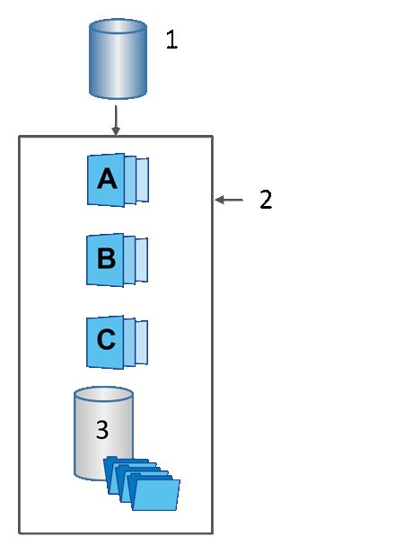

= Obtenga información sobre los volúmenes base, la capacidad reservada y los grupos de instantáneas en SANtricity System Manager
:allow-uri-read: 
:icons: font
:imagesdir: ../media/

[role="lead"]
La función Snapshot utiliza volúmenes base, capacidad reservada y grupos Snapshot.

== Volúmenes base

Un _volumen base_ es el volumen utilizado como origen de una imagen Snapshot. Un volumen base puede ser un volumen grueso o un volumen fino, y puede residir en un pool o un grupo de volúmenes.

Para realizar Snapshot del volumen base, es posible crear una imagen instantánea en cualquier momento, o bien se puede automatizar el proceso definiendo una programación regular para las Snapshot.

En la siguiente figura, se muestra la relación entre los objetos Snapshot y el volumen base.

Volumen base de esta aplicación 1; estos 2 objetos Snapshot en el grupo (imágenes y capacidad reservada); Microsoft 3 capacidad reservada para el grupo Snapshot.

== Capacidad reservada y grupos Snapshot

System Manager organiza las imágenes Snapshot en _grupos Snapshot_. Cuando System Manager establece el grupo Snapshot, crea automáticamente una capacidad _reservada_ asociada para contener las imágenes Snapshot del grupo y realizar un seguimiento de los futuros cambios en las Snapshot adicionales.

Si el volumen base reside en un grupo de volúmenes, la capacidad reservada puede ubicarse en un pool o un grupo de volúmenes. Si el volumen base reside en un pool, la capacidad reservada debe ubicarse en el mismo pool que el volumen base.

Los grupos Snapshot no requieren ninguna acción del usuario, pero se puede ajustar la capacidad de un grupo Snapshot en cualquier momento. Además, es posible que se muestre un mensaje para crear capacidad reservada cuando se cumplan las siguientes condiciones:

* Siempre que se realiza una Snapshot de un volumen base que no tiene grupo Snapshot, System Manager crea automáticamente un grupo Snapshot. Esta acción también crea capacidad reservada para el volumen base que se utiliza para almacenar las futuras imágenes Snapshot.
* Siempre que se crea una programación Snapshot para un volumen base, System Manager crea automáticamente un grupo Snapshot.

== Eliminación automática

Al trabajar con Snapshot, utilice la opción predeterminada para activar la eliminación automática. La eliminación automática elimina automáticamente la imagen Snapshot más antigua cuando el grupo Snapshot llega al límite de 32 imágenes. Si se desactiva la eliminación automática, los límites del grupo Snapshot se superarán en algún momento, y deberá realizar acciones manuales para configurar las opciones del grupo Snapshot y gestionar la capacidad reservada.
