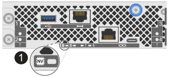

= Cambiar el protocolo del módulo de E/S host
:allow-uri-read: 
:experimental: 
:icons: font
:imagesdir: ../media/

[role="lead"]
Puedes cambiar el protocolo en los módulos de E/S de host para tus controladores cuando necesites un protocolo diferente en tus módulos de E/S existentes, como parte de una actualización de módulos de E/S, o cuando el protocolo predeterminado en los nuevos controladores, ya sea como parte de una nueva instalación de sistema de almacenamiento o de una actualización de controlador, no sea el protocolo que quieres.

.Acerca de esta tarea
* Cambia el protocolo en los módulos de E/S del host preparando, deteniendo las operaciones de E/S del host, cambiando el protocolo y luego configurando el host para que use el nuevo protocolo.
* El protocolo se cambia en todos los módulos de E/S de host de tu sistema de almacenamiento.
* Cuando cambias el protocolo en los módulos de E/S del host, interrumpes temporalmente el acceso del host a todos los volúmenes y el sistema de almacenamiento no estará disponible durante el reinicio, que tarda unos minutos.

== Paso 1: prepárate para el cambio de protocolo

Prepárate para cambiar el protocolo en los módulos de E/S de host verificando el protocolo actual que se está usando, determinando si necesitas cambiar el protocolo y, si es así, programando una ventana de mantenimiento.

.Pasos
. Si no sabes cuál es el protocolo actual en los módulos de E/S de host de tu sistema de almacenamiento, verifícalo usando SANtricity System Manager.
+
.. Selecciona *Settings* > *System*.
.. En la sección *Configuración adicional*, haz clic en *Cambiar protocolo de E/S del host* para abrir esa página.
.. Consulta el protocolo predeterminado que aparece en el campo *Host I/O Protocol*.
+

NOTE: Si quieres ver la lista de protocolos disponibles para tus módulos de E/S de host, selecciona el menú desplegable en el campo *Host I/O Protocol*. La lista de protocolos se basa en los módulos de E/S de host que tienes instalados actualmente.

. El siguiente paso depende de si el protocolo por defecto es el que quieres o no:
+
[cols="1,2"]
|===
| Si... | Entonces... 

 a| 
El protocolo por defecto es el protocolo que quieres
 a| 
No es necesario realizar ninguna acción. Puedes salir de este procedimiento.

 a| 
El protocolo por defecto no es el que quieres
 a| 
Continúa con este procedimiento para cambiar el protocolo.

|===
. Programa una ventana de mantenimiento para este procedimiento.

== Paso 2: detén las operaciones de E/S del host

Debes detener todas las operaciones de E/S del host y luego eliminar todos los hosts definidos del sistema de almacenamiento antes de cambiar el protocolo.

NOTE: No puedes acceder a los datos en el sistema de almacenamiento hasta que completes correctamente el cambio de protocolo.

.Pasos
. Asegúrate de que no se están realizando operaciones de E/S entre el sistema de almacenamiento y todos los hosts conectados. Por ejemplo, puedes realizar estos pasos:
+
** Detén todos los procesos que involucren los LUNs mapeados desde el almacenamiento a los hosts.
** Asegúrate de que ninguna aplicación esté escribiendo datos en ningún LUN asignado desde el almacenamiento a los hosts.
** Desmonta todos los sistemas de archivos asociados con volúmenes en el sistema de almacenamiento.
+

NOTE: Los pasos exactos para detener las operaciones de E/S del host dependen del sistema operativo del host y de la configuración, que quedan fuera del alcance de estas instrucciones. Si no estás seguro de cómo detener las operaciones de E/S del host en tu entorno, considera apagar el host o contacta https://mysupport.netapp.com/site/global/dashboard["Soporte de NetApp"^].

+

CAUTION: *Posible pérdida de datos* -- Si continúas con este procedimiento mientras se están produciendo operaciones de E/S, podrías perder datos.

. En cada controlador, asegúrate de que el LED NV Caching Active (verde) está apagado.
+
Cuando el LED NV Caching Active (verde) está apagado, cualquier dato en la memoria caché ya se ha escrito en las unidades y es seguro continuar con este procedimiento.

+

NOTE: Si el LED NV Caching Active (verde) está encendido, los datos almacenados en caché se están escribiendo en las unidades. Debes esperar a que el proceso termine y el LED NV Caching Active (verde) se apague. Sin embargo, si el LED permanece encendido durante más de cinco minutos, contacta con https://mysupport.netapp.com/site/global/dashboard["Soporte de NetApp"] antes de seguir con este procedimiento.

+
El LED NV Caching Active (verde) está ubicado junto al icono NV en el controlador.

+

+
[cols="1,4"]
|===

 a| 
image::../media/icon_round_1.png[Llamada número 1]
 a| 
Icono NV y LED NV Caching Active en el controlador

|===
. Confirma que las operaciones en los controladores han finalizado en SANtricity System Manager:
+
.. Selecciona *Storage* > *Operations in progress* para ver la pantalla Overview.
.. Espera a que finalicen todas las operaciones y que la pantalla Overview muestre *No operations currently in progress* antes de seguir con el siguiente paso.

. Elimina todos los hosts definidos del sistema de almacenamiento.
+
Para obtener más información sobre la eliminación de hosts, consulta la  https://docs.netapp.com/us-en/e-series-santricity/sm-storage/delete-host-or-host-cluster.html["Eliminar un host o un clúster de hosts"^].

== Paso 3: cambia el protocolo

Usando SANtricity System Manager, cambia el protocolo en los módulos de E/S del host, espera a que los controladores completen su ciclo de reinicio, confirma que su estado es Óptimo y luego vuelve a crear las definiciones del host.

.Pasos
. Selecciona *Settings* > *System*.
. En la sección *Configuración adicional*, haz clic en *Cambiar protocolo de E/S del host* para abrir esa página.
. En el campo *Host I/O Protocol*, haz clic en el menú desplegable y elige el protocolo que quieres usar.
+
La lista de protocolos se basa en los módulos de E/S de host que están instalados actualmente.

. Escribe *CHANGE* en el campo abierto para confirmar tu cambio.
. Selecciona el botón *Cambiar*.
. Espera a que los controladores completen su ciclo de reinicio.
+
Esto puede llevar unos cinco minutos.

. Cuando los controladores vuelvan a estar en línea, confirma que su estado es óptimo usando SANtricity System Manager.
. Vuelve a crear las definiciones de host.
+
Para más información sobre la creación de hosts, consulta el  https://docs.netapp.com/us-en/e-series-santricity/sm-storage/create-host-manually.html["Crear un host o un clúster de hosts"^] procedimiento.

== Paso 4: configura el host para usar el nuevo protocolo

Después de cambiar el protocolo de los puertos del host, tienes que configurarlo para que use el nuevo protocolo.

. Para obtener instrucciones paso a paso, consulta la guía correspondiente para tu sistema de almacenamiento:
+
** link:https://docs.netapp.com/us-en/e-series/config-linux/index.html["Configuración exprés de Linux"]
** link:https://docs.netapp.com/us-en/e-series/config-vmware/index.html["Configuración exprés de VMware"]
** link:https://docs.netapp.com/us-en/e-series/config-windows/index.html["Configuración exprés de Windows"]
+
Los ajustes específicos pueden variar. Consulta el  http://mysupport.netapp.com/matrix["Matriz de interoperabilidad de NetApp"^] para ver instrucciones específicas y ajustes adicionales recomendados para tu solución.

